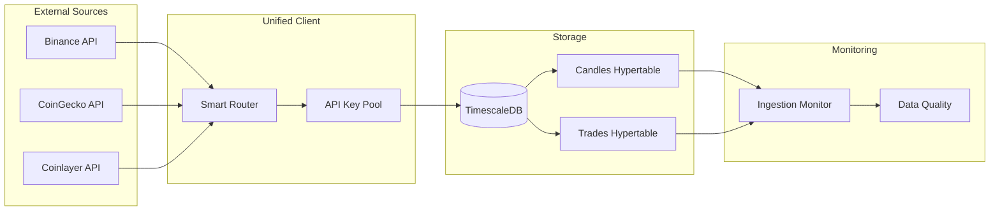
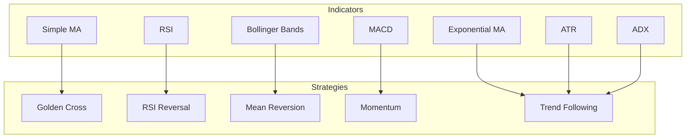
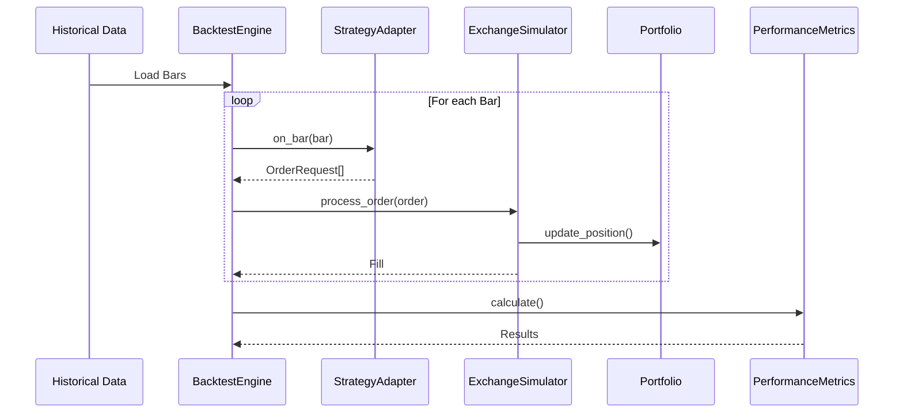
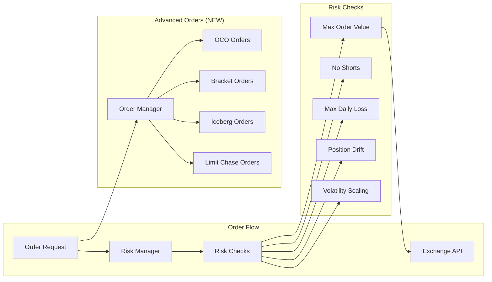
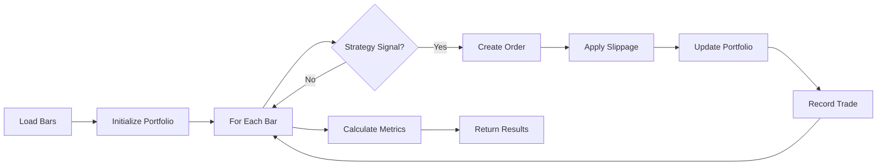
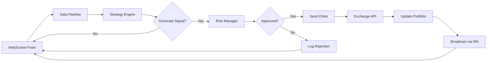
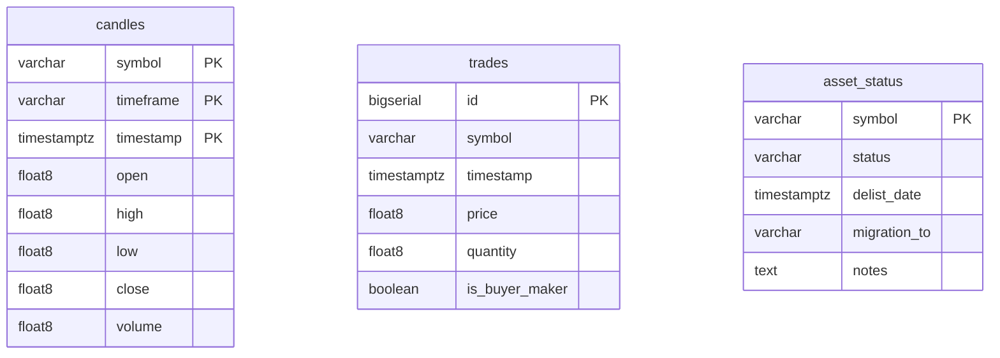
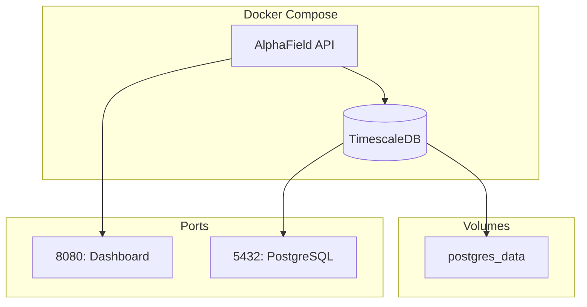

# 🏗️ AlphaField Architecture

## System Overview

AlphaField is a modular, event-driven algorithmic trading system built in Rust. The system is organized as a Cargo workspace with six specialized crates.

```mermaid
graph TD
    subgraph "Data Layer"
        Data[crates/data]
        DB[(TimescaleDB)]
        APIs[External APIs]
    end
    
    subgraph "Core"
        Core[crates/core]
    end
    
    subgraph "Analysis"
        Strategy[crates/strategy]
        Backtest[crates/backtest]
    end
    
    subgraph "Trading"
        Execution[crates/execution]
    end
    
    subgraph "Presentation"
        Dashboard[crates/dashboard]
        Frontend[Web UI]
    end
    
    APIs --> Data
    Data --> DB
    Data --> Core
    Strategy --> Core
    Backtest --> Core
    Backtest --> Data
    Backtest --> Strategy
    Execution --> Core
    Execution --> Strategy
    Dashboard --> Data
    Dashboard --> Backtest
    Dashboard --> Strategy
    Dashboard --> Frontend
```

---

## 📦 Components

### 1. Core (`crates/core`)

Foundational types and traits shared across the system.

| Type | Description |
|------|-------------|
| `Bar` | OHLCV candlestick with timestamp validation |
| `Trade` | Individual trade with MAE/MFE tracking |
| `Order` | Order request (side, quantity, price, type) |
| `Signal` | Strategy output (Buy/Sell/Hold with size) |
| `Strategy` trait | Interface all strategies must implement |
| `QuantError` | Unified error type |

---

### 2. Data Layer (`crates/data`)

Responsible for data ingestion, storage, and quality monitoring.



**Key Features:**
- **Smart Routing**: Binance (primary) → CoinGecko → Coinlayer fallback
- **Compression**: 7-day policy for candles, 1-day for trades
- **Survivorship Bias**: Asset status tracking (active/delisted/migrated)
- **Data Quality**: Gap detection, outlier detection, freshness monitoring

---

### 3. Strategy (`crates/strategy`)

Technical analysis indicators and trading strategies.



---

### 4. Backtest (`crates/backtest`)

Event-driven backtesting engine with advanced analytics.



**Advanced Analysis Modules:**
| Module | Purpose |
|--------|---------|
| Walk-Forward | Rolling train/test validation |
| Monte Carlo | Trade sequence shuffling |
| Sensitivity | Parameter grid search |
| Correlation | Multi-strategy correlation |

**Machine Learning Modules (NEW):**
| Module | Purpose |
|--------|---------|
| FeatureExtractor | Feature engineering from OHLCV data |
| DataSplitter | Time-series aware train/test splits |
| MLModels | Regression/classification models |
| MLStrategy | ML-based trading strategies |
| MLValidation | Walk-forward validation and overfitting detection |

---

### 5. Execution (`crates/execution`)

Risk management and order execution safeguards.



---

### 6. Dashboard (`crates/dashboard`)

Axum web server with REST API and WebSocket streaming.

```mermaid
graph TD
    subgraph "Dashboard Server"
        Axum[Axum Router]
        REST[REST Endpoints]
        WS[WebSocket Hub]
        Static[Static Files]
    end
    
    subgraph "API Modules"
        BacktestAPI[Backtest API]
        WorkflowAPI[Optimization Workflow API]
        DataAPI[Data API]
        QualityAPI[Quality API]
        AnalysisAPI[Analysis API]
        MLAPI[ML API]
        OrdersAPI[Orders API]
    end
    
    subgraph "Frontend"
        UI[Web UI]
        BuildTab[Build Tab: Strategy + Category]
        OptimizeTab[Optimize Tab: Auto-Optimize]
        BacktestTab[Backtest Tab: Symbol Selection]
        DeployTab[Deploy Tab]
        Charts[Charts: Sweep/Sensitivity/Walk-Forward]
        DataManager[Data Manager]
        SentimentUI[Sentiment UI]
        Tables[Tables]
        Console[Log Console]
        MLTab[ML Tab: Model Training/Validation]
        OrdersTab[Orders Tab: Advanced Order Management]
    end
    
    Axum --> REST
    Axum --> WS
    Axum --> Static
    REST --> BacktestAPI
    REST --> WorkflowAPI
    REST --> DataAPI
    REST --> QualityAPI
    REST --> AnalysisAPI
    REST --> MLAPI
    REST --> OrdersAPI
    Static --> UI
    UI --> BuildTab
    UI --> OptimizeTab
    UI --> BacktestTab
    UI --> DeployTab
    UI --> Charts
    UI --> DataManager
    UI --> SentimentUI
    UI --> Tables
    UI --> Console
    UI --> MLTab
    UI --> OrdersTab
    WS --> UI
```



---

## 🎯 Trading Modes

AlphaField supports two trading modes: **Spot** (default, long-only) and **Margin** (opt-in, long+short). This design ensures backward compatibility while enabling advanced trading strategies.

### Mode Overview

| Feature | Spot Mode | Margin Mode |
|---------|-----------|-------------|
| **Positions** | Long only | Long + Short |
| **Funding** | Cash-based | Margin-based |
| **Borrowing** | No | Yes (for shorts) |
| **Default** | ✅ Yes | ❌ Opt-in |
| **Risk** | Lower | Higher |
| **Use Cases** | Long-only strategies | Market neutral, pairs trading, mean reversion |

### Spot Mode (Default)

**Characteristics:**
- Long-only positions (buy and sell to close)
- Cash-based settlement (no leverage or borrowing)
- Simple risk management (unlimited loss potential only on long side)
- Best for: trend following, momentum, breakout strategies

**Component Behavior:**
- `StrategyAdapter`: Only allows Buy when Flat, Sell when Long
- `Portfolio`: Rejects orders that would create negative positions
- `RiskManager`: Enforces `NoShorts` check unconditionally
- `BacktestEngine`: Uses cash-based position sizing

### Margin Mode

**Characteristics:**
- Long and short positions (buy and sell to open/close)
- Margin-based settlement (requires borrowing for shorts)
- Complex risk management (unlimited loss on shorts, short squeeze risk)
- Best for: market neutral, pairs trading, mean reversion, arbitrage

**Component Behavior:**
- `StrategyAdapter`: Full state machine (Flat ↔ Long ↔ Short)
- `Portfolio`: Allows negative positions when in Margin mode
- `RiskManager`: Conditionally disables `NoShorts`, enforces `MaxShortPosition`
- `BacktestEngine`: Supports margin-based position sizing
- **Additional**: Short Squeeze detection, Margin Requirement checks

### System Integration

Trading mode flows through all major components:

```mermaid
graph LR
    subgraph "Strategy Layer"
        S[Strategy]
        SA[StrategyAdapter]
    end
    
    subgraph "Execution Layer"
        RM[RiskManager]
        P[Portfolio]
    end
    
    subgraph "Analysis Layer"
        BE[BacktestEngine]
        MV[MLValidation]
    end
    
    S -->|with_trading_mode()| SA
    SA --> P
    P --> RM
    RM --> BE
    BE --> MV
```

**Configuration Points:**

| Component | Configuration Method | Default |
|-----------|---------------------|---------|
| `StrategyAdapter` | `.with_trading_mode(TradingMode::Margin)` | `Spot` |
| `Portfolio` | `.with_trading_mode(TradingMode::Margin)` | `Spot` |
| `RiskManager` | Conditional checks based on mode | Spot behavior |
| `BacktestEngine` | `.with_trading_mode(TradingMode::Margin)` | `Spot` |
| `MLValidation` | `TradingMode` parameter to constructor | `Spot` |

**Key Types:**
- `TradingMode`: Enum (Spot/Margin) - Core type controlling mode
- `PositionState`: Enum (Flat/Long/Short) - Current position state in strategies
- `Signal`: Buy/Sell/Hold with size - Mode determines signal interpretation

**Backward Compatibility:**
- `Spot` mode is the **default** for all components
- Existing strategies continue to work without changes
- Opt-in `Margin` mode requires explicit configuration
- All existing tests pass with Spot mode (174+ tests)

---

## 🔄 Data Flow

### Backtest Flow



### Live Trading Flow (Future)



---

## 🗄️ Database Schema



**TimescaleDB Features:**
- Hypertables for time-series optimization
- Compression policies (candles: 7 days, trades: 1 day)
- Automatic chunk management

---

## 🔌 External Integrations

| Service | Purpose | Priority |
|---------|---------|----------|
| Binance | OHLC data, ticker, exchange info | Primary |
| CoinGecko | Market data, historical OHLC | Secondary |
| Coinlayer | Daily rates (fallback) | Tertiary |

---

## 🚀 Deployment


