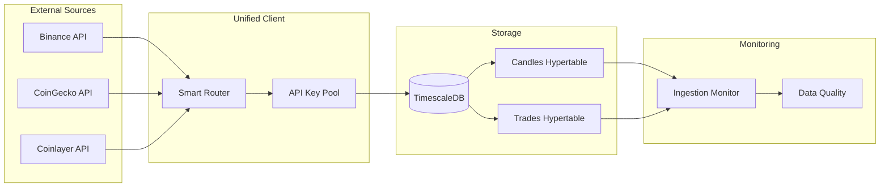
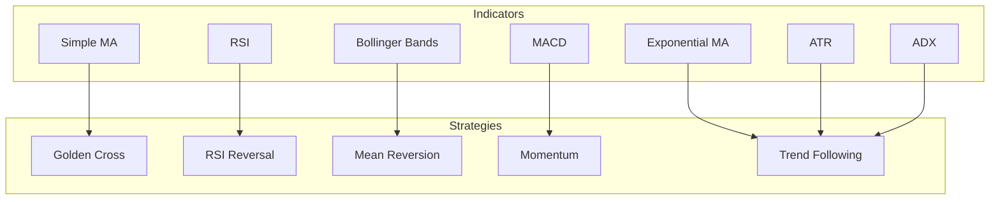
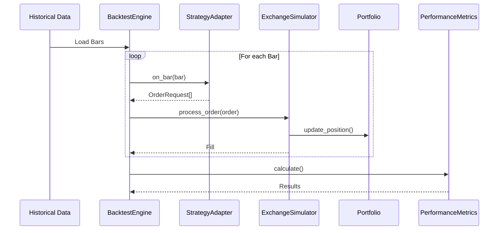
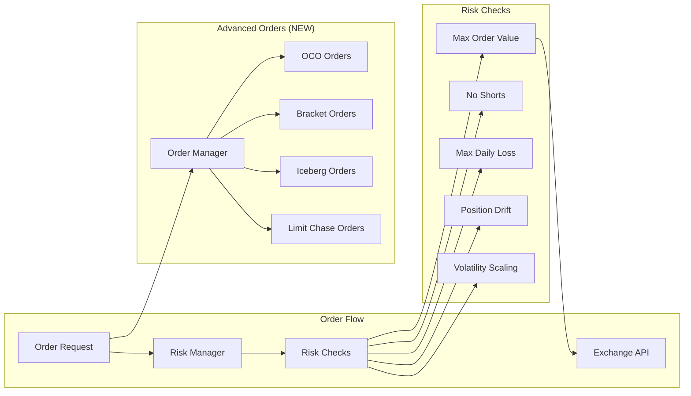
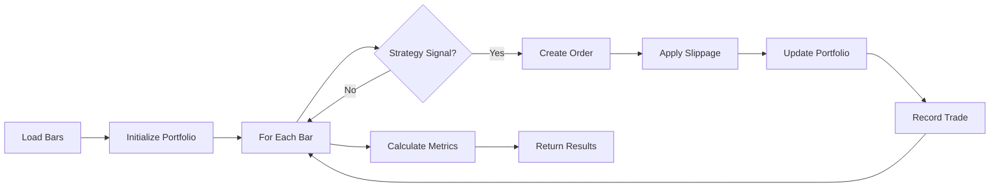
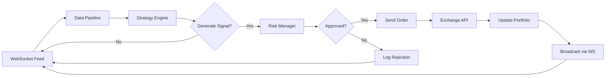
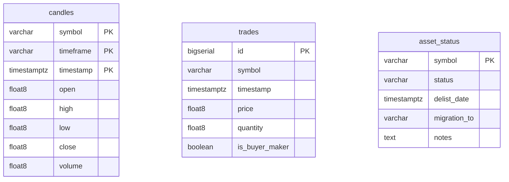
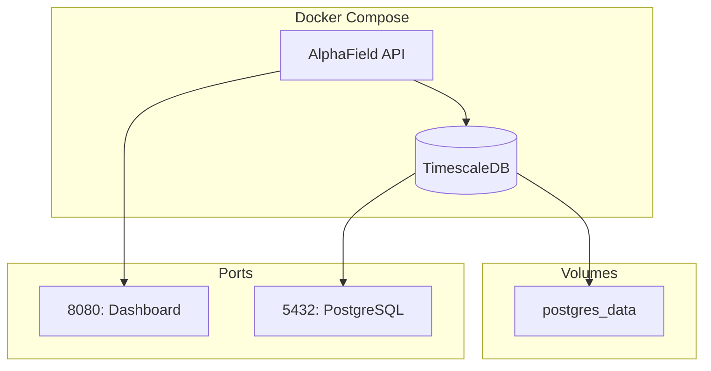

# 🏗️ AlphaField Architecture

## System Overview

AlphaField is a modular, event-driven algorithmic trading system built in Rust. The system is organized as a Cargo workspace with six specialized crates.

```mermaid
graph TD
    subgraph "Data Layer"
        Data[crates/data]
        DB[(TimescaleDB)]
        APIs[External APIs]
    end
    
    subgraph "Core"
        Core[crates/core]
    end
    
    subgraph "Analysis"
        Strategy[crates/strategy]
        Backtest[crates/backtest]
    end
    
    subgraph "Trading"
        Execution[crates/execution]
    end
    
    subgraph "Presentation"
        Dashboard[crates/dashboard]
        Frontend[Web UI]
    end
    
    APIs --> Data
    Data --> DB
    Data --> Core
    Strategy --> Core
    Backtest --> Core
    Backtest --> Data
    Backtest --> Strategy
    Execution --> Core
    Execution --> Strategy
    Dashboard --> Data
    Dashboard --> Backtest
    Dashboard --> Strategy
    Dashboard --> Frontend
```

---

## 📦 Components

### 1. Core (`crates/core`)

Foundational types and traits shared across the system.

| Type | Description |
|------|-------------|
| `Bar` | OHLCV candlestick with timestamp validation |
| `Trade` | Individual trade with MAE/MFE tracking |
| `Order` | Order request (side, quantity, price, type) |
| `Signal` | Strategy output (Buy/Sell/Hold with size) |
| `Strategy` trait | Interface all strategies must implement |
| `QuantError` | Unified error type |

---

### 2. Data Layer (`crates/data`)

Responsible for data ingestion, storage, and quality monitoring.



**Key Features:**
- **Smart Routing**: Binance (primary) → CoinGecko → Coinlayer fallback
- **Compression**: 7-day policy for candles, 1-day for trades
- **Survivorship Bias**: Asset status tracking (active/delisted/migrated)
- **Data Quality**: Gap detection, outlier detection, freshness monitoring

---

### 3. Strategy (`crates/strategy`)

Technical analysis indicators and trading strategies.



---

### 4. Backtest (`crates/backtest`)

Event-driven backtesting engine with advanced analytics.



**Advanced Analysis Modules:**
| Module | Purpose |
|--------|---------|
| Walk-Forward | Rolling train/test validation |
| Monte Carlo | Trade sequence shuffling |
| Sensitivity | Parameter grid search |
| Correlation | Multi-strategy correlation |

**Machine Learning Modules (NEW):**
| Module | Purpose |
|--------|---------|
| FeatureExtractor | Feature engineering from OHLCV data |
| DataSplitter | Time-series aware train/test splits |
| MLModels | Regression/classification models |
| MLStrategy | ML-based trading strategies |
| MLValidation | Walk-forward validation and overfitting detection |

---

### 5. Execution (`crates/execution`)

Risk management and order execution safeguards.



---

### 6. Dashboard (`crates/dashboard`)

Axum web server with REST API and WebSocket streaming.

```mermaid
graph TD
    subgraph "Dashboard Server"
        Axum[Axum Router]
        REST[REST Endpoints]
        WS[WebSocket Hub]
        Static[Static Files]
    end
    
    subgraph "API Modules"
        BacktestAPI[Backtest API]
        WorkflowAPI[Optimization Workflow API]
        DataAPI[Data API]
        QualityAPI[Quality API]
        AnalysisAPI[Analysis API]
        MLAPI[ML API]
        OrdersAPI[Orders API]
    end
    
    subgraph "Frontend"
        UI[Web UI]
        BuildTab[Build Tab: Strategy + Category]
        OptimizeTab[Optimize Tab: Auto-Optimize]
        BacktestTab[Backtest Tab: Symbol Selection]
        DeployTab[Deploy Tab]
        Charts[Charts: Sweep/Sensitivity/Walk-Forward]
        DataManager[Data Manager]
        SentimentUI[Sentiment UI]
        Tables[Tables]
        Console[Log Console]
        MLTab[ML Tab: Model Training/Validation]
        OrdersTab[Orders Tab: Advanced Order Management]
    end
    
    Axum --> REST
    Axum --> WS
    Axum --> Static
    REST --> BacktestAPI
    REST --> WorkflowAPI
    REST --> DataAPI
    REST --> QualityAPI
    REST --> AnalysisAPI
    REST --> MLAPI
    REST --> OrdersAPI
    Static --> UI
    UI --> BuildTab
    UI --> OptimizeTab
    UI --> BacktestTab
    UI --> DeployTab
    UI --> Charts
    UI --> DataManager
    UI --> SentimentUI
    UI --> Tables
    UI --> Console
    UI --> MLTab
    UI --> OrdersTab
    WS --> UI
```



---

## 🎯 Trading Modes

AlphaField supports two trading modes: **Spot** (default, long-only) and **Margin** (opt-in, long+short). This design ensures backward compatibility while enabling advanced trading strategies.

### Mode Overview

| Feature | Spot Mode | Margin Mode |
|---------|-----------|-------------|
| **Positions** | Long only | Long + Short |
| **Funding** | Cash-based | Margin-based |
| **Borrowing** | No | Yes (for shorts) |
| **Default** | ✅ Yes | ❌ Opt-in |
| **Risk** | Lower | Higher |
| **Use Cases** | Long-only strategies | Market neutral, pairs trading, mean reversion |

### Spot Mode (Default)

**Characteristics:**
- Long-only positions (buy and sell to close)
- Cash-based settlement (no leverage or borrowing)
- Simple risk management (unlimited loss potential only on long side)
- Best for: trend following, momentum, breakout strategies

**Component Behavior:**
- `StrategyAdapter`: Only allows Buy when Flat, Sell when Long
- `Portfolio`: Rejects orders that would create negative positions
- `RiskManager`: Enforces `NoShorts` check unconditionally
- `BacktestEngine`: Uses cash-based position sizing

### Margin Mode

**Characteristics:**
- Long and short positions (buy and sell to open/close)
- Margin-based settlement (requires borrowing for shorts)
- Complex risk management (unlimited loss on shorts, short squeeze risk)
- Best for: market neutral, pairs trading, mean reversion, arbitrage

**Component Behavior:**
- `StrategyAdapter`: Full state machine (Flat ↔ Long ↔ Short)
- `Portfolio`: Allows negative positions when in Margin mode
- `RiskManager`: Conditionally disables `NoShorts`, enforces `MaxShortPosition`
- `BacktestEngine`: Supports margin-based position sizing
- **Additional**: Short Squeeze detection, Margin Requirement checks

### System Integration

Trading mode flows through all major components:

```mermaid
graph LR
    subgraph "Strategy Layer"
        S[Strategy]
        SA[StrategyAdapter]
    end
    
    subgraph "Execution Layer"
        RM[RiskManager]
        P[Portfolio]
    end
    
    subgraph "Analysis Layer"
        BE[BacktestEngine]
        MV[MLValidation]
    end
    
    S -->|with_trading_mode()| SA
    SA --> P
    P --> RM
    RM --> BE
    BE --> MV
```

**Configuration Points:**

| Component | Configuration Method | Default |
|-----------|---------------------|---------|
| `StrategyAdapter` | `.with_trading_mode(TradingMode::Margin)` | `Spot` |
| `Portfolio` | `.with_trading_mode(TradingMode::Margin)` | `Spot` |
| `RiskManager` | Conditional checks based on mode | Spot behavior |
| `BacktestEngine` | `.with_trading_mode(TradingMode::Margin)` | `Spot` |
| `MLValidation` | `TradingMode` parameter to constructor | `Spot` |

**Key Types:**
- `TradingMode`: Enum (Spot/Margin) - Core type controlling mode
- `PositionState`: Enum (Flat/Long/Short) - Current position state in strategies
- `Signal`: Buy/Sell/Hold with size - Mode determines signal interpretation

**Backward Compatibility:**
- `Spot` mode is the **default** for all components
- Existing strategies continue to work without changes
- Opt-in `Margin` mode requires explicit configuration
- All existing tests pass with Spot mode (174+ tests)

---

## 🔄 Data Flow

### Backtest Flow



### Live Trading Flow (Future)



---

## 🗄️ Database Schema



**TimescaleDB Features:**
- Hypertables for time-series optimization
- Compression policies (candles: 7 days, trades: 1 day)
- Automatic chunk management

---

## 🔌 External Integrations

| Service | Purpose | Priority |
|---------|---------|----------|
| Binance | OHLC data, ticker, exchange info | Primary |
| CoinGecko | Market data, historical OHLC | Secondary |
| Coinlayer | Daily rates (fallback) | Tertiary |

---

## 🚀 Deployment



---

## 🔄 Component Interaction Examples

This section provides practical code examples showing how components interact in real-world scenarios.

### Data Ingestion Flow

Complete workflow from fetching data from external APIs to storing in TimescaleDB:

```rust
use alphafield_data::{UnifiedDataClient, TimescaleDB, IngestionMonitor};
use chrono::{Utc, Duration};
use std::env;

#[tokio::main]
async fn main() -> Result<(), Box<dyn std::error::Error>> {
    // 1. Initialize components
    let client = UnifiedDataClient::builder()
        .binance_key(env::var("BINANCE_API_KEY")?)
        .coingecko_key(env::var("COINGECKO_API_KEY")?)
        .build()?;

    let db = TimescaleDB::from_env().await?;
    let monitor = IngestionMonitor::new();

    // 2. Fetch data with automatic failover
    let end = Utc::now();
    let start = end - Duration::days(30);

    // Automatically routes: Binance → CoinGecko → Coinlayer
    let bars = client.fetch_bars("BTCUSDT", start, end).await?;

    // 3. Validate data quality
    let gaps = monitor.check_gaps(&bars)?;
    let outliers = monitor.check_outliers(&bars)?;

    if !gaps.is_empty() || !outliers.is_empty() {
        eprintln!("Data quality issues: {} gaps, {} outliers",
            gaps.len(), outliers.len());
    }

    // 4. Store validated data
    for bar in &bars {
        db.store_bar(bar).await?;
    }

    println!("Ingested {} bars for BTCUSDT", bars.len());
    Ok(())
}
```

**Why this pattern?**
- **UnifiedDataClient**: Handles failover automatically
- **Quality monitoring**: Detects issues before storage
- **TimescaleDB**: Optimized for time-series queries
- **Async I/O**: Non-blocking network operations

### Strategy Backtest Flow

Complete workflow from strategy definition to backtest results:

```rust
use alphafield_backtest::{BacktestEngine, SlippageModel};
use alphafield_strategy::GoldenCross;
use alphafield_data::TimescaleDB;
use chrono::{Utc, Duration};

#[tokio::main]
async fn main() -> Result<(), Box<dyn std::error::Error>> {
    // 1. Load historical data
    let db = TimescaleDB::from_env().await?;

    let end = Utc::now();
    let start = end - Duration::days(365);  // 1 year of data

    let bars = db.query_bars("BTCUSDT", start, end, None).await?;

    // 2. Create strategy
    let strategy = GoldenCross::new(50, 200);

    // 3. Setup backtest engine
    let mut engine = BacktestEngine::new(
        rust_decimal::Decimal::from(100_000),  // $100k initial capital
        rust_decimal::Decimal::from_str("0.001")?,  // 0.1% fee
        SlippageModel::FixedPercent(rust_decimal::Decimal::from_str("0.0005")?),
    );

    engine.add_data("BTCUSDT", bars);
    engine.set_strategy(Box::new(strategy));

    // 4. Run backtest
    let metrics = engine.run()?;

    // 5. Analyze results
    println!("Total Return: {:.2}%", metrics.total_return * 100.0);
    println!("Sharpe Ratio: {:.2}", metrics.sharpe_ratio);
    println!("Max Drawdown: {:.2}%", metrics.max_drawdown * 100.0);
    println!("Win Rate: {:.2}%", metrics.win_rate * 100.0);
    println!("Total Trades: {}", metrics.total_trades);
    println!("Profit Factor: {:.2}", metrics.profit_factor);

    Ok(())
}
```

**Why this pattern?**
- **Separate concerns**: Strategy logic independent of backtest engine
- **Realistic costs**: Includes fees and slippage
- **Comprehensive metrics**: Multiple performance indicators
- **Reproducible**: Same data always produces same results

### Multi-Strategy Ensemble Flow

Combining multiple strategies for robust signals:

```rust
use alphafield_strategy::{GoldenCross, RsiReversionStrategy, Momentum};
use alphafield_core::{Strategy, Signal};

struct EnsembleStrategy {
    strategies: Vec<Box<dyn Strategy>>,
    consensus_threshold: usize,
}

impl EnsembleStrategy {
    pub fn new() -> Self {
        Self {
            strategies: vec![
                Box::new(GoldenCross::new(50, 200)),
                Box::new(RsiReversionStrategy::new(14, 70, 30)),
                Box::new(Momentum::new(12, 26, 9)),
            ],
            consensus_threshold: 2,  // 2 out of 3 must agree
        }
    }
}

impl Strategy for EnsembleStrategy {
    fn generate_signal(&self, bars: &[alphafield_core::Bar]) -> Option<Signal> {
        // Collect signals from all strategies
        let buy_votes = self.strategies.iter()
            .filter_map(|s| s.generate_signal(bars))
            .filter(|sig| matches!(sig.signal_type, alphafield_core::SignalType::Buy))
            .count();

        let sell_votes = self.strategies.iter()
            .filter_map(|s| s.generate_signal(bars))
            .filter(|sig| matches!(sig.signal_type, alphafield_core::SignalType::Sell))
            .count();

        // Only trade if consensus reached
        if buy_votes >= self.consensus_threshold {
            Some(Signal::buy(0.9, rust_decimal::Decimal::from(1), chrono::Utc::now()))
        } else if sell_votes >= self.consensus_threshold {
            Some(Signal::sell(0.9, rust_decimal::Decimal::from(1), chrono::Utc::now()))
        } else {
            Some(Signal::hold(chrono::Utc::now()))
        }
    }

    fn update(&mut self, bar: &alphafield_core::Bar) {
        for strategy in &mut self.strategies {
            strategy.update(bar);
        }
    }

    fn name(&self) -> &str {
        "EnsembleStrategy"
    }
}
```

**Why this pattern?**
- **Consensus reduces false signals**: Multiple strategies must agree
- **Diversification**: Different strategies (trend + mean reversion + momentum)
- **Maintains strategy independence**: Each strategy manages its own state
- **Adjustable threshold**: Can tune how conservative the ensemble is

### Dashboard API Integration Flow

Example of integrating with dashboard REST API:

```bash
# Start dashboard server
cargo run --bin dashboard

# In another terminal, run commands

# 1. Create and backtest a strategy
curl -X POST http://localhost:8080/api/backtest \
  -H "Content-Type: application/json" \
  -d '{
    "strategy": {
      "type": "RSIReversion",
      "parameters": {
        "period": 14,
        "overbought": 70,
        "oversold": 30
      }
    },
    "symbol": "BTCUSDT",
    "interval": "1h",
    "start": "2024-01-01T00:00:00Z",
    "end": "2024-12-31T23:59:59Z",
    "initial_capital": 100000,
    "fee_rate": 0.001
  }'

# 2. Run optimization workflow
curl -X POST http://localhost:8080/api/optimization/start \
  -H "Content-Type: application/json" \
  -d '{
    "strategy_name": "RSIReversion",
    "symbol": "BTCUSDT",
    "interval": "1h",
    "parameters": {
      "period": {"min": 10, "max": 20, "step": 2},
      "overbought": {"min": 65, "max": 80, "step": 5},
      "oversold": {"min": 20, "max": 35, "step": 5}
    }
  }'

# 3. Query data quality
curl -X GET "http://localhost:8080/api/quality?symbol=BTCUSDT&start=2024-01-01&end=2024-12-31"

# 4. Get performance metrics
curl -X GET "http://localhost:8080/api/backtest/{backtest_id}/metrics"
```

**Why this pattern?**
- **REST API**: Standardized interface for all operations
- **JSON payloads**: Easy to integrate with web UI
- **Asynchronous**: Long-running operations (optimization) don't block
- **Idempotent**: Same request produces same result

### Walk-Forward Validation Flow

Advanced validation with rolling train/test windows:

```rust
use alphafield_backtest::WalkForwardAnalyzer;
use alphafield_strategy::RsiReversionStrategy;
use chrono::Duration;

#[tokio::main]
async fn main() -> Result<(), Box<dyn std::error::Error>> {
    // Load data
    let bars = load_bars_from_db()?;

    // Create analyzer
    let strategy = RsiReversionStrategy::new(14, 70, 30);
    let analyzer = WalkForwardAnalyzer::new(
        strategy,
        Duration::days(90),   // Train on 3 months
        Duration::days(30),   // Test on 1 month
        Duration::days(30),   // Step forward by 1 month
    );

    // Run analysis
    let results = analyzer.run(&bars)?;

    // Analyze stability
    let returns: Vec<f64> = results.iter().map(|r| r.total_return).collect();
    let avg_return = returns.iter().sum::<f64>() / returns.len() as f64;
    let return_std = calculate_std_dev(&returns);
    let stability_ratio = avg_return / return_std;

    println!("Average Return: {:.2}%", avg_return * 100.0);
    println!("Return Std Dev: {:.2}%", return_std * 100.0);
    println!("Stability Ratio: {:.2}", stability_ratio);

    // High stability ratio = robust strategy
    // Low stability ratio = overfit to training data

    Ok(())
}
```

**Why this pattern?**
- **Prevents overfitting**: Tests on out-of-sample data
- **Simulates real trading**: Retrains regularly like production
- **Measures robustness**: Consistency across time windows
- **Adapts to regimes**: Captures different market conditions

### Best Practices

1. **Always validate data**: Check for gaps, outliers, freshness before using
2. **Use failover**: Don't rely on single data source
3. **Test on out-of-sample data**: Walk-forward prevents overfitting
4. **Include costs**: Fees and slippage impact results significantly
5. **Monitor in real-time**: Set up alerts for data quality issues
6. **Use async I/O**: Non-blocking operations for better performance
7. **Bundle database operations**: Use transactions for consistency
8. **Log comprehensively**: Track data lineage for debugging

