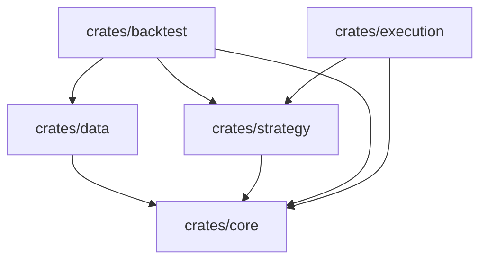
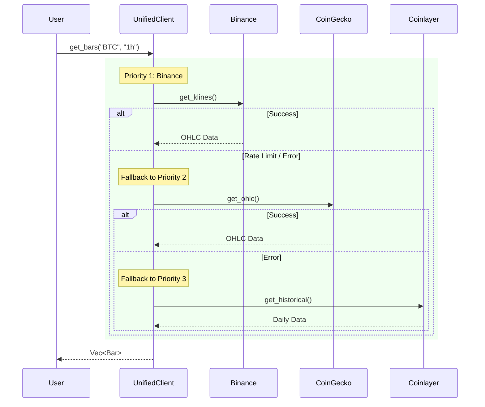

# 🏗️ AlphaField Architecture

## System Overview

AlphaField is designed as a modular, event-driven system. The core components are separated into distinct crates to ensure separation of concerns and testability.

## 📦 Components

### 1. Core (`crates/core`)
Contains the fundamental data structures and traits shared across the system.
- **Types**: `Bar`, `Trade`, `Order`, `Position`, `Signal`.
- **Traits**: `Strategy`, `DataSource`, `ExecutionService`.

### 2. Data Layer (`crates/data`)
Responsible for fetching and normalizing market data.
- **UnifiedDataClient**: The main entry point. Abstracts away specific APIs.
- **Smart Routing**:
    - **OHLC**: Binance (Primary) -> CoinGecko -> Coinlayer.
    - **Market Data**: CoinGecko (Primary) -> Binance.
- **Resilience**: `ApiKeyPool` handles rotation and rate limiting.

### 3. Strategy (`crates/strategy`)
Contains trading logic.
- **Indicators**: Technical analysis tools.
- **Signals**: Logic to convert market data into trade signals.

### 4. Backtest (`crates/backtest`)
Simulates strategy performance.
- **Engine**: Replays historical data.
- **Portfolio**: Tracks virtual account state.
- **Matcher**: Simulates order fills.

## 🔄 Data Flow (Unified Data Layer)

The Data Layer uses a smart routing approach to ensure high availability and data quality.

