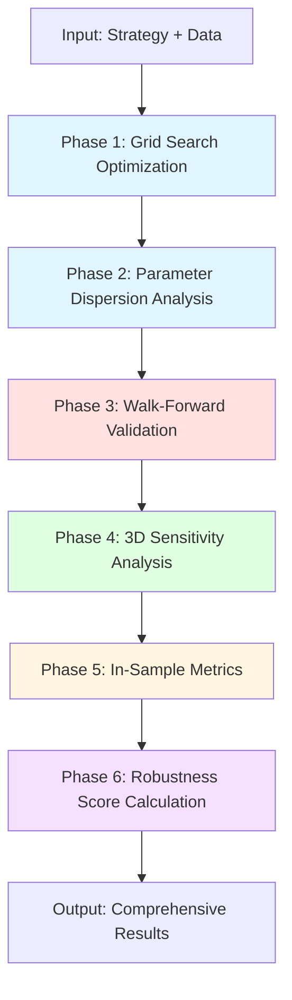
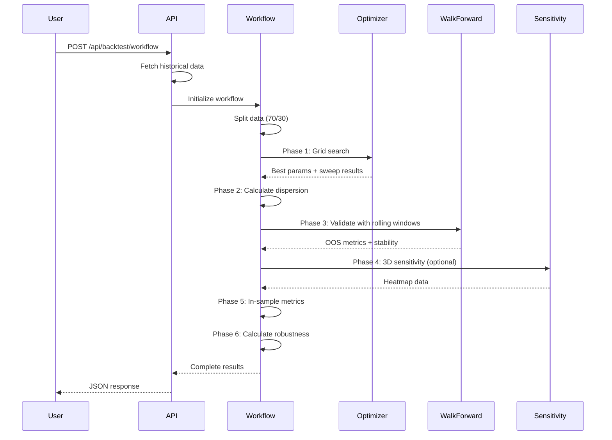

# Parameter Optimization Workflow

## Overview

The comprehensive parameter optimization workflow provides an integrated pipeline for finding robust trading strategy parameters while avoiding overfitting. The workflow combines multiple analytical techniques to validate parameter stability and strategy robustness.

## Architecture



## Workflow Phases

### Phase 1: Grid Search Optimization

The workflow begins by splitting the data into **in-sample (70%)** and **out-of-sample (30%)** periods. Grid search is performed on the in-sample data to find optimal parameter combinations.

**Key Metrics:**
- Composite fitness score (combines Sharpe ratio, return, win rate, and drawdown)
- Best parameters across all tested combinations
- Complete sweep results for visualization

### Phase 2: Parameter Dispersion Analysis

Calculates statistical measures of parameter sensitivity to identify robust vs. fragile parameter regions.

**Metrics Calculated:**
- **Sharpe CV (Coefficient of Variation)**: Lower values indicate less sensitivity to parameter changes
- **Return CV**: Variation in returns across parameter combinations
- **Positive Sharpe %**: Percentage of parameter combinations with positive Sharpe ratio
- **Positive Return %**: Percentage of profitable parameter combinations
- **Sharpe Range**: Max - Min Sharpe across all combinations
- **Return Range**: Max - Min return across all combinations

**Interpretation:**
- **Low CV (< 0.5)**: Robust parameters, less prone to overfitting
- **High CV (> 1.0)**: Fragile parameters, high overfitting risk
- **High Positive %**: Strategy works across many parameter values

### Phase 3: Walk-Forward Validation

Tests the optimized parameters on rolling time windows to validate stability across different market regimes.

**Configuration:**
- **Training Window**: 252 bars (default ~1 year daily data)
- **Test Window**: 63 bars (default ~3 months)
- **Step Size**: 21 bars (default ~1 month advance)

**Metrics:**
- Mean and median out-of-sample return
- Stability score (0-1, measures train/test consistency)
- Worst drawdown across all windows
- Win rate (% of windows with positive returns)

### Phase 4: 3D Sensitivity Analysis (Optional)

Generates heatmap data for the two most important parameters to visualize performance across the parameter space.

**Output:**
- X and Y parameter values
- Sharpe ratio matrix
- Total return matrix
- Max drawdown matrix

**Use Case:**
- Identify stable parameter "plateaus" vs. sharp peaks
- Visualize robustness of optimal parameters
- Detect overfitting (single sharp peak = red flag)

### Phase 5: In-Sample Metrics

Calculates detailed performance metrics on the in-sample period with optimized parameters.

### Phase 6: Robustness Score

Combines all validation metrics into a single **robustness score (0-100)**:

```
Robustness Score = 
    0.30 * Walk-Forward Stability +
    0.30 * (1 / (1 + Sharpe CV)) +
    0.20 * Positive Sharpe % +
    0.20 * OOS Win Rate
```

**Interpretation:**
- **80-100**: Highly robust, low overfitting risk
- **60-79**: Good robustness, acceptable for trading
- **40-59**: Moderate robustness, use with caution
- **< 40**: High overfitting risk, not recommended

## API Endpoint

### POST `/api/backtest/workflow`

Run the comprehensive optimization workflow for a trading strategy.

**Request Body:**
```json
{
  "strategy": "GoldenCross",
  "symbol": "BTCUSDT",
  "interval": "1h",
  "days": 730,
  "include_3d_sensitivity": true,
  "train_window_days": 252,
  "test_window_days": 63
}
```

**Parameters:**
- `strategy` (required): Strategy name (GoldenCross, Rsi, MeanReversion, Momentum)
- `symbol` (required): Trading pair symbol
- `interval` (required): Timeframe (1m, 5m, 15m, 1h, 4h, 1d)
- `days` (required): Total historical data period
- `include_3d_sensitivity` (optional): Enable 3D sensitivity analysis (default: true)
- `train_window_days` (optional): Walk-forward training window (default: 252)
- `test_window_days` (optional): Walk-forward test window (default: 63)

**Response:**
```json
{
  "success": true,
  "optimized_params": {
    "fast_period": 10.0,
    "slow_period": 50.0,
    "take_profit": 6.0,
    "stop_loss": 4.0
  },
  "best_score": 0.68,
  "best_sharpe": 1.85,
  "best_return": 0.42,
  "in_sample_sharpe": 1.78,
  "in_sample_return": 0.39,
  "in_sample_max_drawdown": -0.15,
  "walk_forward_mean_return": 0.12,
  "walk_forward_median_return": 0.10,
  "walk_forward_stability_score": 0.72,
  "walk_forward_worst_drawdown": -0.22,
  "walk_forward_windows": 8,
  "parameter_dispersion": {
    "sharpe_std": 0.42,
    "return_std": 0.08,
    "sharpe_cv": 0.35,
    "return_cv": 0.45,
    "positive_sharpe_pct": 68.5,
    "positive_return_pct": 62.3,
    "sharpe_range": 2.8,
    "return_range": 0.65
  },
  "robustness_score": 73.5,
  "sweep_results": [
    {
      "params": {"fast_period": 5.0, "slow_period": 30.0, ...},
      "score": 0.45,
      "sharpe": 1.2,
      "total_return": 0.25,
      "max_drawdown": -0.18,
      "win_rate": 0.58,
      "total_trades": 42
    }
    // ... more results
  ],
  "sensitivity_heatmap": {
    "x_param": "fast_period",
    "y_param": "slow_period",
    "x_values": [5, 10, 15, 20, 25, 30],
    "y_values": [30, 40, 50, 60, 70, 80, 90, 100],
    "sharpe_matrix": [[...], [...], ...],
    "return_matrix": [[...], [...], ...],
    "drawdown_matrix": [[...], [...], ...]
  },
  "elapsed_ms": 45230,
  "error": null
}
```

## User Flow



## Usage Examples

### Example 1: Basic Optimization

```bash
curl -X POST http://localhost:8080/api/backtest/workflow \
  -H "Content-Type: application/json" \
  -d '{
    "strategy": "GoldenCross",
    "symbol": "BTCUSDT",
    "interval": "1d",
    "days": 730
  }'
```

### Example 2: Custom Walk-Forward Configuration

```bash
curl -X POST http://localhost:8080/api/backtest/workflow \
  -H "Content-Type: application/json" \
  -d '{
    "strategy": "Rsi",
    "symbol": "ETHUSDT",
    "interval": "4h",
    "days": 365,
    "train_window_days": 180,
    "test_window_days": 45,
    "include_3d_sensitivity": true
  }'
```

### Example 3: Fast Optimization (No 3D Sensitivity)

```bash
curl -X POST http://localhost:8080/api/backtest/workflow \
  -H "Content-Type: application/json" \
  -d '{
    "strategy": "Momentum",
    "symbol": "BTCUSDT",
    "interval": "1h",
    "days": 180,
    "include_3d_sensitivity": false
  }'
```

## Interpretation Guide

### Identifying Robust Strategies

✅ **Good Signs:**
- Robustness score > 70
- Sharpe CV < 0.5
- Walk-forward stability > 0.6
- Positive Sharpe % > 60%
- Heatmap shows broad plateau (not sharp peak)

⚠️ **Warning Signs:**
- Robustness score < 50
- Sharpe CV > 1.0
- Walk-forward stability < 0.4
- Positive Sharpe % < 40%
- Heatmap shows isolated peak

❌ **Red Flags:**
- Robustness score < 30
- Sharpe CV > 2.0
- Walk-forward stability < 0.2
- Large gap between in-sample and OOS performance
- Single sharp peak in sensitivity heatmap

### Parameter Dispersion Interpretation

**Low Dispersion (Good):**
- Strategy performance is stable across parameter ranges
- Less risk of overfitting
- Parameters are "forgiving" (small changes don't break strategy)

**High Dispersion (Bad):**
- Strategy is highly sensitive to exact parameter values
- High overfitting risk
- Parameters were likely "curve-fit" to historical data

## Integration with Existing Backtest Flow

The optimization workflow is **additive** and does not modify the existing backtest API:

- **Existing backtest** (`/api/backtest/run`): Quick single-run backtests with known parameters
- **Simple optimization** (`/api/backtest/optimize`): Grid search only
- **Comprehensive workflow** (`/api/backtest/workflow`): Full validation pipeline

All three endpoints remain available for different use cases.

## Performance Considerations

**Execution Time:**
- Grid search: Depends on parameter grid size (typically 10-500 combinations)
- Walk-forward: Depends on number of windows (typically 5-15 windows)
- 3D sensitivity: Most expensive (can be disabled)

**Typical Runtime:**
- Small grid (50 combinations): 10-30 seconds
- Medium grid (200 combinations): 30-90 seconds
- Large grid (500+ combinations): 90-300 seconds

**Optimization Tips:**
- Use coarser parameter steps for initial exploration
- Disable 3D sensitivity for faster results
- Reduce walk-forward windows for quicker validation
- Use higher timeframes (4h, 1d) for faster backtests

## Future Enhancements

- [ ] Parallel parameter sweep execution
- [ ] Multi-objective optimization (Pareto frontier)
- [ ] Genetic algorithm optimization
- [ ] Bayesian optimization
- [ ] Parameter importance ranking
- [ ] Ensemble strategy creation from robust regions
